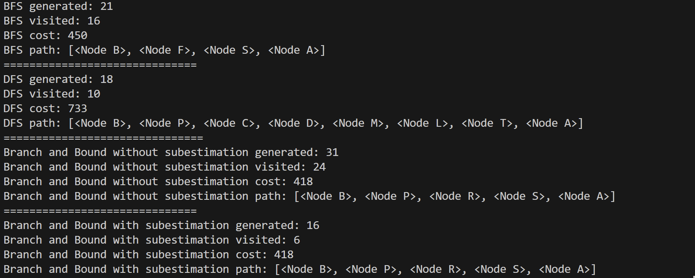
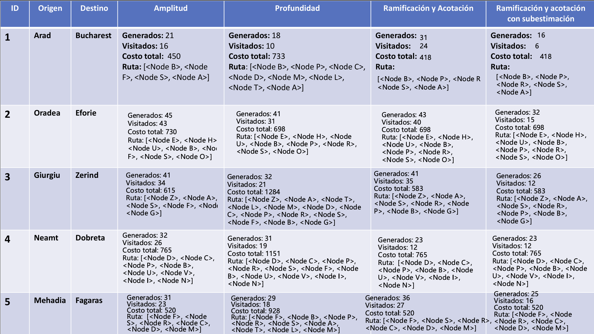

# FSI-search

## Autora

María Cabrera Vérgez

## Tarea realizada

### Parte 1

**Obligatorio**
A partir del código base de la práctica ampliarlo para que incluya la estrategia de búsqueda de Ramificación y Acotación.
- Es esencial que la funcionalidad actual del código base no se vea afectada por la adición. Todas las interfaces deberían respetarse. Es altamente recomendable (aunque no imprescindible) adherirse a la filosofía actual del código.
- Observar que la gestión del coste acumulado ya está soportada en el propio código base, en el atributo path_cost del nodo.

**Opcional**
Implementar manualmente una búsqueda en el grafo de Rumanía con la estrategia de Ramificación y Acotación. Deben realizarse al menos cinco iteraciones.

### Parte 2
**Obligatorio**
En las mismas condiciones que la parte 1 agregar ahora la estrategia de búsqueda Ramificación y Acotación con Subestimación. La heurística que se empleará es la distancia euclídea- Observar que el cálculo de la heurística ya está soportado en el propio código base.

**Opcional**
Mostrar con un ejemplo que una heurística que sobreestima no garantiza alcanzar un camino óptimo.

### Parte 3

**Obligatorio**
Implementar en el código una contabilidad de nodos generados y nodos visitados.

Número de nodos generados
El número total de nodos creados durante la búsqueda.
Número de nodos visitados
El número total de nodos a los que se han interrogado si apuntan o no al objetivo.
Con estos datos completar la tabla comparativa que se ofrece. En cada celda de la tabla deberá constar para cada trayecto y para cada estrategia de búsqueda:
- Número de nodos generados
- Número de nodos visitados
- La ruta solución encontrada
- Coste total de la solución encontrada.
- Tiempo de ejecución de la búsqueda (Opcional)

## Trabajo realizado

### search.py

En primer lugar, lo que se hizo es cambiar la función graph_search() para poder contar los nodos visitados o generados. A la función se le pasa el problema (una instancia de la clase Problem, para definir el estado inicial, el objetivo, los sucesores y calcular el coste) y fringe, que es una estructura de datos para mantener los nodos que se encuentran pendientes de ser explorados. 

Dentro de un diccionario se van guardando los nodos que ya han sido visitados para no entorpecer la exploración. Los nodos visitados se inicializan en 0, mientras que los generdos empiezan en 1 porque ya se cuenta el nodo inicial. La variable cost almacena el coste de la solución encontrada en la búsqueda.

Se crea un nodo inicial, se que meto dentro del finge y se aumenta en 1 el número de nodos visitados.

``` python
def graph_search(problem, fringe):
    """Search through the successors of a problem to find a goal.
    The argument fringe should be an empty queue.
    If two paths reach a state, only use the best one. [Fig. 3.18]"""
    closed = {}

    visited_nodes = 0
    generated_nodes = 1
    cost = 0

    fringe.append(Node(problem.initial))
    visited_nodes += 1
```
Si fringe sigue teniendo nodos, se saca uno para revisarlo. En el caso del BFS, es el más antiguo (FIFO, First In, First Out), en el caso del DFS, el más reciente (LIFO, Last In, First Out) y en el caso de Branch and Bound, el de menor coste.

Si se ha llegado al nodo que se buscaba, entonces se guarda el coste acumulado y devuelve el nodo, los visitados, generados y el coste. Si ya ha sido visitado, se evita repetir el proceso. Se van a generar todos los sucesores del nodo actual como sus hijos. Se añaden al fringe y se actualiza la cantidad de nodos generados, sumando los hijos.

Cada nodo que es sacado del fringe, se considerará visitado.

``` python
while fringe:
        node = fringe.pop()

        if problem.goal_test(node.state):
            cost = node.path_cost
            return node, visited_nodes, generated_nodes, cost

        if node.state not in closed:
            closed[node.state] = True
            children = node.expand(problem)
            fringe.extend(children)
            generated_nodes += len(children)

        visited_nodes += 1
``` 

Si el fringe se queda vacío y no ha sido encontrado el objetivo, se devuelve None y los diversos contadores realizados.

``` python
return None, visited_nodes, generated_nodes, cost
```

Para implementar las dos estrategias pedidas:

#### Branch_and_Bound_Without()

Es una estructura de datos personalizados. Los datos se mantienen ordenados por coste acumulado. Al ser si subestimación, no se una ninguna heurística. Solo se considera el coste real del nodo inicial hasta el actual.

``` python
def branch_and_bound_Without(problem):
    return graph_search(problem, Branch_and_Bound_Without_Subestimation())
```

#### Branch_and_Bound_With()

Crea un fringe con los nodos ordenados por el coste más la heurística. La subestimación significa que se usa la heurística para poder podar ramas que no ofrecen posibles soluciones.

``` python
def branch_and_bound_With(problem):
    return graph_search(problem, Branch_and_Bound_With_Subestimation(problem))
```

### utils.py

Las implementaciones realizadas dentro del archivo utils.py, son las siguientes.

#### Branch_and_Bound_Without_Subestimation()

La clase se inicializa con una lista de nodos a explorar. Para no mover la lista al hacer pop(), se usará start. De esa forma, solo se avanza el índice.

La función append() añade un nodo al final de la lista. __len_ devuelve aquellos nodos que queden activos en la lista. Se resta start para quitar aquellos que ya fueron sacados con pop(). La función extend() añade varios nodos a la lista A. Se ordena según el coste, haciendo que pop() devuelve el nodo más barato.

Además, se van haciendo recortes de elementos que no se necesiten para que la lista no sea extremadamente grande.

``` python
class Branch_and_Bound_Without_Subestimation(Queue):
    def __init__(self):
        self.A = []
        self.start = 0

    def append(self, item):
        self.A.append(item)

    def __len__(self):
        return len(self.A) - self.start

    def extend(self, items):
            self.A.extend(items)
            self.A.sort(key = lambda node:  (node.path_cost))

    def pop(self):
        e = self.A[self.start]
        self.start += 1
        if self.start > 5 and self.start > len(self.A) / 2:
            self.A = self.A[self.start:]
            self.start = 0
        return e
```

#### Branch_and_Bound_With_Subestimation

Por su lado, la clase con subestimación también guarda el problem para poder tener la heurística disponible para usarla. La diferencia que presenta con la versión anteriormente contada, es que en extend() se ordena por el coste más la heurística. El resto de funciones se mantienen iguales.

``` python
class Branch_and_Bound_With_Subestimation(Queue):
    def __init__(self, problem):
        self.A = []
        self.start = 0
        self.problem = problem

    def append(self, item):
        self.A.append(item)

    def __len__(self):
        return len(self.A) - self.start

    def extend(self, items):
        self.A.extend(items)
        self.A.sort(key=lambda node: node.path_cost + self.problem.h(node))

    def pop(self):
        e = self.A[self.start]
        self.start += 1
        if self.start > 5 and self.start > len(self.A) / 2:
            self.A = self.A[self.start:]
            self.start = 0
        return e
```

### Ejecución

Para poder mostrar los resultados por pantalla, se reutiliza la definición del problema del código base, donde se aclaran cuales eran los nodos origen y destino del recorrido a realizar. En cada caso, se llama a la función de la estrategia para obtener los datos que interesan: nodos generados, nodos visitados, coste y camino. Con los datos guardados, se imprimen y se van comparando los resultados de cada estrategia. Por ejemplo, en el caso del ejemplo, donde se quiere ir desde Arad a Bucharest, los resultados serán:



Si se desean ver otros caminos, solo debe de cambiarse al inicio las letras que hacen referencia al origen y destino.

### Tabla



